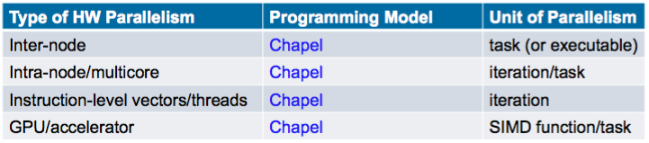

# Notes about Chapel

## Contents
- Background
- Language Basics
- Task Parallelism
- Locales
- Data Parallelism
- Domain-Maps
- Project State

## Background
**General parallel programming**


**Multiresolution design**
Support multi-tiers of features
- higher levels for programmability, productivity
- lower levels for greater degrees of control
- build the higher-level concepts in terms of the lower
- permit the user to intermix layers arbitrarily


**Reduce [HPC - Mainstream Language] gap**
- to leverage advances in modern language design
- to better utilize the skills of the entry-level workforce while not alienating the traditional HPC programmer.
  - support OOP, but make it optional
  
## Language Basics
### Variables, Constants, and Params
```
var     identifier [: type] [= init-expr];
const   identifier [: type] [= init-expr];
param   identifier [: type] [= init-expr];

var/const: execution-time variable / constant
param:     compile-time constant
```

**_Example_**

~~~~
const pi: real = 3.14159;
var count: int;             // initialized to 0
param debug = true;         // inferred to be bool
~~~~

### Static Type Inference
~~~~
const pi = 3.14,                      // pi is a real
coord = 1.2 + 3.4i,                   // coord is a complex...
coord2 = pi*coord,                    // ...as is coord2
name = "brad",                        // name is a string
verbose = false;                      // verbose is boolean

proc addem(x, y) {                    // addem() has generic arguments
  return x + y;                       // and an inferred return type
}

var sum = addem(1, pi),               // sum is a real
    fullname = addem(name, "ford");   // fullname is a string

writeln((sum, fullname));
~~~~

### Config
~~~~
config param intSize = 32;
config type elementType = real(32);
config const epsilon = 0.01:elementType;
config var start = 1:int(intSize);

$ chpl myProgram.chpl -sintSize=64 -selementType=real
$ ./a.out --start=2 --epsilon=0.00001
~~~~

### Record and Class
#### Record
~~~~
record circle {
  var radius: real;
  proc area() {
      return pi*radius**2;
  }
}

var c1, c2: circle;
c1 = new circle(radius=1.0);
c2 = c1;
c1.radius = 5.0;
writeln(c2.radius); // 1.0
// records deleted by compiler
~~~~

#### Class
~~~~
class circle {
  var radius: real;
  proc area() {
      return pi*radius**2;
  }
}

var c1, c2: circle;
c1 = new circle(radius=1.0);
c2 = c1; // aliases c1’s circle
c1.radius = 5.0;
writeln(c2.radius); // 5.0
delete c1; // users delete classes
~~~~

### Tuples
Tuples support lightweight grouping of values.
- passing/returning procedure arguments
- multidimensional array indices
- short vectors

~~~~
var coord: (int, int, int) = (1, 2, 3);
var coordCopy: 3*int = coord;
var (i1, i2, i3) = coord;
var triple: (int, string, real) = (7, "eight", 9.0);
~~~~

### Array types
~~~~
var A: [1..3] int,                      // A stores 0, 0, 0
B = [5, 3, 9],                          // B stores 5, 3, 9
C: [1..m, 1..n] real,                   // 2D m by n array of reals
D: [1..m][1..n] real;                   // array of arrays of reals
~~~~

### Range values
~~~~
1..6                                    // 1, 2, 3, 4, 5, 6
6..1                                    // empty
3..                                     // 3, 4, 5, 6, 7, ...
~~~~

**_Example_**

~~~~
const r = 1..10;
printVals(r);                           // 1 2 3 4 5 6 7 8 9 10
printVals(0.. #n);                      // 0 1 2 3 4 ... n-1
printVals(r # 3);                       // 1 2 3
printVals(r by 2);                      // 1 3 5 7 9
printVals(r by -2);                     // 10 8 6 4 2
printVals(r by 2 # 3);                  // 1 3 5
printVals(r # 3 by 2);                  // 1 3

proc printVals(r) {
  for i in r do
    write(i, " ");
  writeln();
}
~~~~

### For loop
~~~~
var A: [1..3] string = [" DO", " RE", " MI"];
for i in 1..3 { write(A[i]); }                      // DO RE MI
for a in A { a += "LA"; }                           // DOLA RELA MILA
write(A);
~~~~

### Reference declaration
~~~~
var A: [1..3] string = [" DO", " RE", " MI"];
ref a2 = A[2];                                      // Reference declaration
a2 = " YO";
for i in 1..3 { write(A(i)); }                      // DO YO MI
~~~~

### Iterator definition
~~~~
iter fibonacci(n) {
  var current = 0,
  next = 1;
  for 1..n {
    yield current;
    current += next;
    current <=> next;
  }
}

for f in fibonacci(7) do writeln(f);
0 1 1 2 3 5 8
~~~~

### Zippered iteration
~~~~
for (i,f) in zip(0..#n, fibonacci(n)) do
  writeln("fib #", i, " is ", f);

fib #0 is 0
fib #1 is 1
fib #2 is 1
fib #3 is 2
fib #4 is 3
fib #5 is 5
fib #6 is 8
~~~~

### Procedure
Procedure can be declared with or without return types. Argument types can be also omitted.

~~~~
proc area(radius: real): real {
  return 3.14 * radius**2;
}

proc area(radius) {
  return 3.14 * radius**2;
}
~~~~
