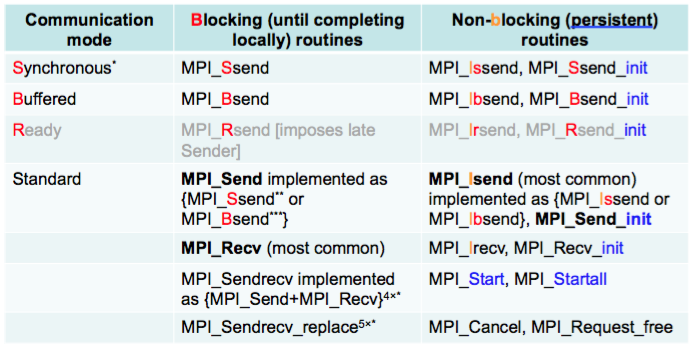
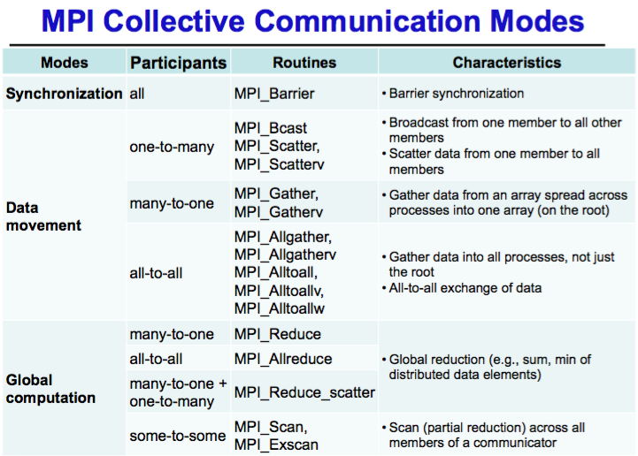
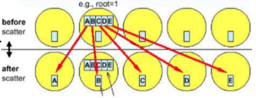
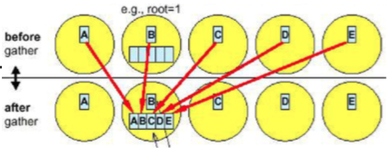
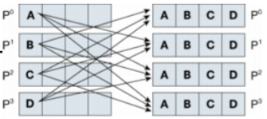
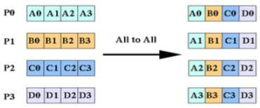
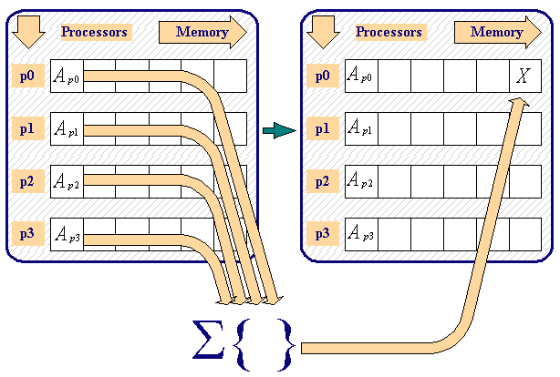
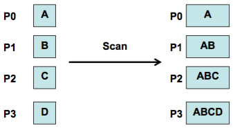

# MPI notes

## Contents
- Communicator
- Point-to-Point communication
  - Blocking
  - Non-blocking
  - Synchronization
- Collective communication
  - Synchronization
  - Data movement
  - Collective computation    

## The minimal set of MPI routines

```c
MPI_Init              Initializes MPI.
MPI_Comm_size         Determines the number of processes.
MPI_Comm_rank         Determines the label of calling process.
MPI_Send              Sends a message.
MPI_Recv              Receives a message.
MPI_Finalize          Terminates MPI.
```

## Process Group & Communicator
### Communicator
A **communicator** defines a communication domain- a set of processes that are allowed to communicate with each other.

Type: MPI_Comm
Default communicator: MPI_COMM_WORLD (includes all the processes)

```c
int MPI_Comm_size(MPI_Comm comm, int *size)
int MPI_Comm_rank(MPI_Comm comm, int *rank)
```

Note: A process can belong to many different (possibly overlapping) communication domains.

**_Example_**:

```c
#include "stdio.h"
#include "mpi.h"

main(int argc, char *argv[])
{
  int npes, myrank;
  MPI_Init(&argc, &argv);
  MPI_Comm_size(MPI_COMM_WORLD, &npes);     //npes = total number of CPU cores
  MPI_Comm_rank(MPI_COMM_WORLD, &myrank);   //myrank = processing core
  printf("From process %d out of %d, Hello World!\n",  myrank, npes);
  MPI_Finalize();
}
```

## Point-to-Point communication



### Blocking
```c
int MPI_Send(void *buf, int count, MPI_Datatype datatype, int dest, int tag, MPI_Comm comm)
int MPI_Recv(void *buf, int count, MPI_Datatype datatype, int source, int tag, MPI_Comm comm, MPI_Status *status)
```

#### Supported datatypes
```c
MPI_CHAR
MPI_SHORT
MPI_INT
MPI_LONG
MPI_UNSIGNED_CHAR
MPI_UNSIGNED_SHORT
MPI_UNSIGNED
MPI_UNSIGNED_LONG
MPI_FLOAT
MPI_DOUBLE
MPI_LONG_DOUBLE
MPI_BYTE
MPI_PACKED
```

#### Status
- For a receive operation,information may be requested via status record `MPI_Status`.
- MPI_SOURCE, MPI_TAG.
- MPI_GetCount: Request number of information elements received.

```c
rc = MPI_Get_count(&Stat, MPI_CHAR, &count);
printf("Task %d: Received %d char(s) from task %d with tag %d \n", rank, count, Stat.MPI_SOURCE, Stat.MPI_TAG);
```

#### Deadlock potential
When two (or more) processes are blocked and each is waiting for the other to make progress, **deadlock** occurs. Neither process makes progress because each depends on the other to make progress first.

- Wrong send-receive order
- Over buffer

#### Exchanging messages
```c
int MPI_Sendrecv(void *sendbuf, int sendcount, MPI_Datatype senddatatype, int dest,
       int sendtag, void *recvbuf, int recvcount,
       MPI_Datatype recvdatatype, int source, int recvtag,
       MPI_Comm comm,
       MPI_Status *status)
```

If using the same buffer for both send and receive, we can use:

```c
int MPI_Sendrecv_replace(void *buf, int count, MPI_Datatype datatype, int dest,
      int sendtag, int source, int recvtag,
      MPI_Comm comm, MPI_Status *status)
```

### Non-blocking
#### Purpose
- Deadlock avoidance
- Performance improving

```c
int MPI_Isend(void *buf, int count, MPI_Datatype datatype,
               int dest, int tag, MPI_Comm comm,
               MPI_Request *request)
int MPI_Irecv(void *buf, int count, MPI_Datatype datatype,
               int source, int tag, MPI_Comm comm,
               MPI_Request *request)
```

These operations return immediately, before the operations have been completed.

#### Synchronization
**MPI_Wait**

Function MPI_Wait waits for the operation to complete.

```c
int MPI_Wait(MPI_Request *request, MPI_Status *status)

MPI_Wait(&reqSend, &statSend);
MPI_Wait(&reqRecv, &statRecv);
```

Note: need to be waited for both send and receive operations.

**MPI_Waitall**

```c
MPI_Waitall(int count, MPI_Request *request, MPI_Status *status)

MPI_Request req[2];
MPI_Status stat[2];
...
MPI_Isend(..., &req[0]);
MPI_Isend(..., &req[1]);
MPI_Waitall(2, &req, &stat);
```

- Blocks until all active requests in array complete; return status of all communications.
- De-allocate request objects, set `request` to `MPI_REQUEST_NULL`

**MPI_Waitany**

```c
MPI_Waitany(int count, MPI_Request *request, int *index, MPI_Status *status)

MPI_Request req[2];
MPI_Status stat;
Int index;
...
MPI_Isend(..., &req[0]);
MPI_Isend(..., &req[1]);
MPI_Waitany(2, &req, &index, &stat);
```

- Blocks until one of the active requests in array completes; return its index in array and the status of completing request.
- De-allocate that request object.
- If none completes, return index=MPI_UNDEFINED.

**MPI_Waitsome**

```c
MPI_Waitsome(int incount, MPI_Request *req, int *outcount, int *array_indices, MPI_Status *array_status)
```

- Blocks until at least one of the active communications completes; return associated indices and status of completed communications.
- De-allocate objects.
- If none, outcount = MPI_UNDEFINED.

#### Check status
Function **MPI_Test** tests whether or not the non-blocking send or receive operation identified by its request has finished.

```c
int MPI_Test(MPI_Request *request, int *flag, MPI_Status *status)
```

Similar to **MPI_Wait**, **MPI_Test** also supports **MPI_Testall**, **MPI_Testany**, **MPI_Testsome**.

#### Persistent non-blocking
- A communication with same arguments is executed repeatedly.
- Can create a persistent request that will not be de-allocated by `MPI_Wait`.

```c
MPI_Send_init, MPI_Recv_init              Create persistent request
MPI_Start                                 Start communication
MPI_Wait, MPI_Test                        Complete communication
MPI_Request_free                          Free persistent request
```

**_Example_**

```c
MPI_Request req_send, req_recv;
double A[100], B[100];
int left_neighbor, right_neighbor, tag=999;
MPI_Status stat_send, stat_recv;
...
MPI_Send_init(A,100,MPI_DOUBLE,left_neighbor,tag,MPI_COMM_WORLD,&req_send);
MPI_Recv_init(B,100,MPI_DOUBLE,right_neighbor,tag,MPI_COMM_WORLD,&req_recv);
MPI_Start(&req_send);
MPI_Start(&req_recv);
... // do something else useful
MPI_Wait(&req_send, &stat_send);
MPI_Wait(&req_recv, &stat_recv);
MPI_Request_free(&req_send); MPI_Request_free(&req_recv);
```

## Collective communication


### Synchronization
The **MPI_BARRIER** routine blocks the calling process until all group processes have called the function. When MPI_BARRIER returns, all processes are synchronized at the barrier. Note that MPI_BARRIER synchronizes the processes but does not pass data. It is nevertheless categorized as one of the collective communications routines.

```c
MPI_Comm comm
int MPI_Barrier(comm)
```

### Data movement
#### Broadcast
The **MPI_BCAST** routine enables you to copy data from the memory of the root processor to the same memory locations for other processors in the communicator.

```c
int MPI_Bcast(void *buf, int count, MPI_Datatype datatype, int root, MPI_Comm comm)
```

- `comm`, `root` must be the same in all processes.
- The amount of data sent must be equal to amount of data received, pairwise between each process and the root. It means count and datatype must be the same for all processes.

**_Example_**

```c
MPI_Init(&argc, &argv);
MPI_Comm_rank(MPI_COMM_WORLD, &rank);
if(rank == 5) param = 23.0;
MPI_Bcast(param, 1, MPI_DOUBLE, 5, MPI_COMM_WORLD);
printf("Process: %d after broadcast parameter is %f \n", rank, param);
MPI_Finalize();
```

#### Scatter - Gather
The **MPI_SCATTER** routine is a `one-to-all` communication. Different data are sent from the root process to each process (in rank order). When MPI_SCATTER is called, the root process breaks up a set of contiguous memory locations into equal chunks and sends one chunk to each processor. The outcome is the same as if the root executed N MPI_SEND operations and each process executed an MPI_RECV. The send arguments are only meaningful to the root process.



```c
int MPI_Scatter ( void* send_buffer, int send_count, MPI_datatype send_type,
                  void* recv_buffer, int recv_count, MPI_Datatype recv_type,
                  int root, MPI_Comm comm )
```

- `send_buffer`, `send_count`, `send_type` important only at root, ignored in other processes.
- `send_count` is the number of items sent to each process, not the total number of items in send_buffer.

**_Example_**

```c
int A[1000], B[100];
// assume 10 processors
MPI_Scatter(A, 100, MPI_INT, B, 100, MPI_INT, 1, MPI_COMM_WORLD);
```

The **MPI_GATHER** routine is an `all-to-one` communication. MPI_GATHER has the same arguments as the matching scatter routines. The receive arguments are only meaningful to the root process. When MPI_GATHER is called, each process (including the root process) sends the contents of its send buffer to the root process. The root process receives the messages and stores them in rank order. The gather also could be accomplished by each process calling MPI_SEND and the root process calling MPI_RECV N times to receive all of the messages.



```c
int MPI_Gather ( void* send_buffer, int send_count, MPI_datatype send_type,
                 void* recv_buffer, int recv_count, MPI_Datatype recv_type,
                 int root, MPI_Comm comm )
```

- Gathers message to `root`; concatenated based on rank order at root process.
- `root` and `comm` must be identical on all processes.
- `recv_buffer`, `recv_count`, `recv_type` are only important at root; ignored in other processes.
- `recv_buffer` and `send_buffer` cannot be the same on root process.
- Amount of data sent from a process must be equal to amount of data received at root. It means:
  - `recv_count`=`send_count`.
  - `recv_type`=`send_type`.

**_Example_**

```c
int rank, ncpus;
int root = 0;
int *data_received = NULL, data_send[100];

// assume running with 10 cpus
MPI_Comm_rank(MPI_COMM_WORLD, &rank);
MPI_Comm_size(MPI_COMM_WORLD, &ncpus);
if (rank == root)
  data_received = new int[100 * ncpus];

MPI_Gather(data_send, 100, MPI_INT, data_received, 100, MPI_INT, root, MPI_COMM_WORLD);
```

#### Gather to all
In the MPI_GATHER **_Example_**, after the data are gathered into processor 0, you could then MPI_BCAST the gathered data to all of the other processors. It is more convenient and efficient to gather and broadcast with the single **MPI_ALLGATHER** operation, which will result in the following:



```c
int MPI_Allgather ( void* send_buffer, int send_count, MPI_datatype send_type,
                    void* recv_buffer, int recv_count, MPI_Datatype recv_type,
                    MPI_Comm comm )
```

- `send_count`=`recv_count`,`send_type`=`recv_type`
- `recv_count` is the number of items from each process, not the total number of items received.

**_Example_**

```c
int A[100], B[1000];
// assume 10 processors
MPI_Allgather(A, 100, MPI_INT, B, 100, MPI_INT, MPI_COMM_WORLD);
```

#### All to all
Important for distributed matrix transposition; critical to FFT-based algorithms.



```c
int MPI_Alltoall ( void *send_buffer, int send_count, MPI_Datatype send_type,
                   void *recv_buffer, int recv_count, MPI_Datatype recv_type,
                   MPI_Comm comm )
```

- `send_count` is the number of items sent to each process, not the total number of items in `send_buffer`.
- `recv_count` is the number of items received from each process, not the total number of items received.
- Most stressful communication.
- `send_count` = `recv_count`; `send_type` = `recv_type`.

**_Example_**

```c
double A[4], B[4];
// assume 4 cpus

for (i = 0; i < 4; i++) A[i] = my_rank + i;
MPI_Alltoall (A, 1, MPI_DOUBLE, B, 1, MPI_DOUBLE, MPI_COMM_WORLD);
```

### Collective computation
#### Reduction
The **MPI_REDUCE** routine enables you to:
- Collect data from each processor.
- Reduce these data to a single value (such as a sum or max).
- Store the reduced result on the root processor.



```c
int MPI_Reduce ( void* send_buffer, void* recv_buffer, int count, MPI_Datatype datatype,
                 MPI_Op operation, int rank, MPI_Comm comm )

send_buffer     in    address of send buffer
recv_buffer     out   address of receive buffer
count           in    number of elements in send buffer
datatype        in    data type of elements in send buffer
operation       in    reduction operation
rank            in    rank of root process
comm            in    mpi communicator

Available MPI_Op:

MPI_MAX	              maximum
MPI_MIN               minimum
MPI_SUM               sum
MPI_PROD              product
MPI_LAND              logical and
MPI_BAND	            bit-wise and
MPI_LOR               logical or
MPI_BOR               bit-wise or
MPI_LXOR              logical xor
MPI_BXOR              bitwise xor
MPI_MINLOC            min-min value-location
MPI_MAXLOC            max-min value-location
```

**_Example_**

```c
#include <stdio.h>
#include <mpi.h>
void main(int argc, char *argv[])
{
   int rank;
   int source, result, root;

   /* run on 10 processors */

   MPI_Init(&argc, &argv);
   MPI_Comm_rank(MPI_COMM_WORLD, &rank);
   root = 7;
   source = rank + 1;
   MPI_Barrier(MPI_COMM_WORLD);

   MPI_Reduce(&source, &result, 1, MPI_INT, MPI_PROD, root, MPI_COMM_WORLD);
   if (rank == root)
      printf("P:%d MPI_PROD result is %d \n", rank, result);

   MPI_Finalize();
}
```

#### Reduction for All
Reduction result stored in output buffer of all processors.

```c
int MPI_Allreduce ( void* send_buffer, void* recv_buffer, int count, MPI_Datatype datatype,
                 MPI_Op operation, MPI_Comm comm )
```

#### Reduce-Scatter
Used to combine the contents of each process's operand using the operator. Then scatters the result across all of the processes in comm. It has the same result as an MPI_REDUCE operation followed by MPI_SCATTER, in which the send_counts equal recv_counts, except it may be faster.

```c
int MPI_Reduce_scatter ( void *send_buffer, void *recv_buffer, int *recv_counts,
                         MPI_Datatype datatype, MPI_Op op, MPI_Comm comm)
```

#### Scan
Performs a prefix reduction on data distributed across the group. Returns, in the receive buffer of the process with rank i, the reduction of the values in the send buffers of processes with ranks 0,...,i (inclusive).

```c
int MPI_Scan ( void *send_buffer, void *recv_buffer, int count, MPI_Datatype datatype,
               MPI_Op op, MPI_Comm comm)
```


