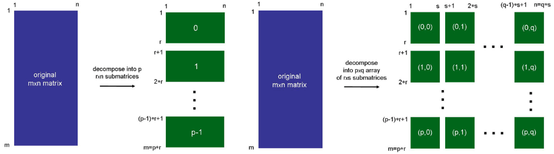
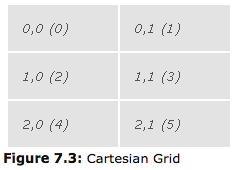
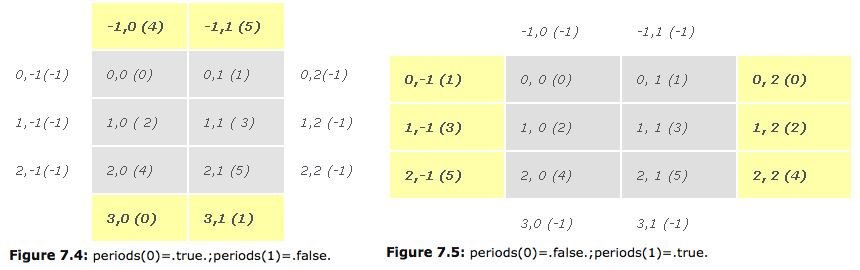
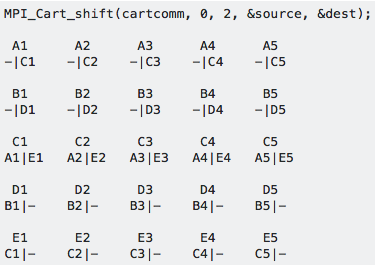

# Virtual Topologies

## Objectives
Problems involving the manipulation of large matrices. One **_Example_** is an [m x n] matrix decomposed into p [q x n] sub-matrices, with a sub-matrix assigned to each p process. Or the matrix could be decomposed into a p x q logical grid, whose elements are themselves each an [r x s] matrix.



This requirement might be due to efficiency considerations, ease in code implementation, or code clarity. Although it is possible to refer to each of these p x q subdomains by a sequential rank number, a 2-dimensional rank numbering system, as shown in Figure 2, results in a much clearer and natural computational representation. To address the needs of this and other topological layouts, the MPI library provides two types of topology routines:

- Cartesian
- Graph

where the graph topologies allow more flexibility.

In this lesson, you will learn about the Cartesian topology and its associated routines along with some practical applications using Cartesian topology.

## MPI Topology Routines
```
MPI_CART_CREATE
MPI_CART_COORDS
MPI_CART_RANK
MPI_CART_SUB
MPI_CARTDIM_GET
MPI_CART_GET
MPI_CART_SHIFT
```

### MPI_CART_CREATE
The **MPI_CART_CREATE** routine creates a new communicator using a Cartesian topology.

~~~~
int MPI_Cart_create ( MPI_Comm old_comm, int ndims, int *dim_size,
                      int *periods, int reorder, MPI_Comm *new_comm)

old_comm          input    existing communicator
ndims             input    number of dimensions of Cartesian topology
dim_size          input    vector, dimension [ndims], number of processes in each direction
periods           input    vector, dimension [ndims], true or false, periodic or not in each direction
reorder           input    true: is allowed to reorder rank; false: no re-ordering of ranks
new_comm          output   new communicator with Cartesian topology
~~~~

For **_Example_** we use MPI_CART_CREATE to map (or rename) 6 processes from a linear ordering (i.e., 0,1,2,3,4,5) into a two-dimensional matrix ordering of 3 rows by 2 columns (i.e., (0,0), (0,1), ..., (2,1) ). Figure below depicts the resulting Cartesian grid representation for the processes.

~~~~
#include "mpi.h"
MPI_Comm old_comm, new_comm;
int ndims, reorder, periods[2], dim_size[2];

old_comm = MPI_COMM_WORLD;
ndims = 2;           /*  2-D matrix/grid */
dim_size[0] = 3;     /* rows */
dim_size[1] = 2;     /* columns */
periods[0] = 1;      /* row periodic (each column forms a ring) */
periods[1] = 0;      /* columns nonperiodic */
reorder = 1;         /* allows processes reordered for efficiency */

MPI_Cart_create(old_comm, ndims, dim_size, periods, reorder, &new_comm);
~~~~



With processes renamed in a 2-dimensional grid topology, we are able to assign or distribute work, or distinguish among the processes by their grid topology rather than by their linear process ranks.

With periods[0] = 1 (true), we have imposed periodicity along the first dimension, which means that any reference beyond the first or last entry of any column will be wrapped around cyclically. For **_Example_**, row index i = -1, due to periodicity, corresponds to i = 2. Similarly, i = -2 maps onto i = 1. No periodicity is imposed on the second dimension (periods[1] = 0). Any reference to the column index outside of its defined range (in this case 0 to 1) will result in a negative process rank (equal to MPI_PROC_NULL which is -1)



MPI provides routines to convert ranks to Cartesian coordinates and vice-versa: **MPI_CART_COORDS** and **MPI_CART_RANK**

### MPI_CART_COORDS
The **MPI_CART_COORDS** routine returns the corresponding Cartesian coordinates of a (linear) rank in a Cartesian communicator.

```
int MPI_Cart_coords( MPI_Comm comm, int rank, int maxdims, int *coords )

comm           input     Communicator handle
rank           input     Calling process rank
maxdims        input     Number of dimensions in cartesian topology
coords         output    Corresponding cartesian coordinates of rank
```

**_Example_**

~~~~
MPI_Cart_create ( old_comm, ndims, dim_size,
                  periods, reorder, &new_comm);  /* creates communicator */

if (Iam == root) {   /* only want to do this on one process */
   for (rank=0; rank‹p; rank++) {
       MPI_Cart_coords(new_comm, rank, ndims, coords);
       printf("%d, %d\n ",rank, coords[0], coords[1]);
   }
 }
~~~~

### MPI_CART_RANK
The **MPI_CART_RANK** routine returns the corresponding process rank of the Cartesian coordinates of a Cartesian communicator.

```
int MPI_Cart_rank( MPI_Comm comm, int *coords, int *rank )

comm           input     Cartesian communicator handle
coords         input     Array of size ndims specifying Cartesian coordinates
rank           output    Process rank of process specified by its Cartesian coordinates, coords
```

**_Example_**

~~~~
MPI_Cart_create (old_comm, ndims, dim_size,
                 periods, reorder, &new_comm);

if (Iam == root) {       /* only want to do this on one process */
  for (i = 0; i ‹ nv; i++) {
    for (j = 0; j ‹ mv; j++)  {
      coords[0] = i;
      coords[1] = j;
      MPI_Cart_rank(new_comm, coords, &rank);
      printf("%d, %d, %d\n",coords[0],coords[1],rank);
    }
  }
}
~~~~

### MPI_CART_SUB
The **MPI_CART_SUB** routine creates new communicators for sub-grids of up to (N-1) dimensions from an N-dimensional Cartesian grid. For **_Example_**, the sub-grids of a 2-dimensional Cartesian grid are 1-dimensional grids of the individual rows or columns. Similarly, for a 3-dimensional Cartesian grid, the sub-grids can either be 2- or 1-dimensional.

```
int MPI_Cart_sub( MPI_Comm old_comm, int *belongs, MPI_Comm *new_comm )

old_comm        input    Cartesian communicator handle
belongs         input    Array of size ndims specifying whether a dimension belongs to new_comm
new_comm        output   Cartesian communicator handle
```

**_Example_**

~~~~
/* Create 2D Cartesian topology for processes */
  MPI_Cart_create(MPI_COMM_WORLD, ndim, dims, period, reorder, &comm2D);
  MPI_Comm_rank(comm2D, &id2D);
  MPI_Cart_coords(comm2D, id2D, ndim, coords2D);

/* Create 1D row subgrids */
  belongs[0] = 0;
  belongs[1] = 1;      /* this dimension belongs to subgrid */
  MPI_Cart_sub(comm2D, belongs, &commrow);

/* Create 1D column subgrids */
  belongs[0] = 1;      /* this dimension belongs to subgrid */
  belongs[1] = 0;
  MPI_Cart_sub(comm2D, belongs, &commcol);
~~~~

### MPI_CARTDIM_GET
The **MPI_CARTDIM_GET** routine determines the number of dimensions of a sub-grid communicator. On occasions, a sub-grid communicator may be created in one routine and subsequently used in another routine. If the dimension of the sub-grid is not available, it can be determined by MPI_CARTDIM_GET.

```
int MPI_Cartdim_get (MPI_Comm comm, int *ndims)

comm          input      Cartesian communicator handle
ndims         output     Number of dimensions
```

**_Example_**

~~~~
/* create column sub-grids */
 belongs[0] = 1;
 belongs[1] = 0;
 MPI_Cart_sub(grid_comm, belongs, &col_comm);

/* queries number of dimensions of Cartesian grid */
 MPI_Cartdim_get(col_comm, &ndims);
~~~~

### MPI_CART_GET
The **MPI_CART_GET** routine retrieves properties such as periodicity and size of a sub-grid. On occasions, a sub-grid communicator may be created in one routine and subsequently used in another routine. If only the communicator is available in the latter, this routine, along with MPI_CARTDIM_GET, may be used to determine the size and other pertinent information about the sub-grid.

```
int MPI_Cart_get( MPI_Comm subgrid_comm, int ndims, int *dims, int *periods, int *coords )

subgrid_comm     input   Communicator handle
ndims            input   Number of dimensions
dims             output  Array of size ndims providing length in each dimension
periods          output  Array of size ndims specifying periodicity status of each dimension
coords           output  Array of size ndims providing Cartesian coordinates of calling process
```

**_Example_**

~~~~
/* create Cartesian topology for processes */
  dims[0] = nrow;
  dims[1] = mcol;
  MPI_Cart_create(MPI_COMM_WORLD, ndim, dims, period, reorder, &grid_comm);
  MPI_Comm_rank(grid_comm, &me);
  MPI_Cart_coords(grid_comm, me, ndim, coords);

/* create column subgrids */
  remain[0] = 1;
  remain[1] = 0;
  MPI_Cart_sub(grid_comm, remain, &row_comm);

/* Retrieve subgrid dimensions and other info */
  MPI_Cartdim_get(row_comm, &mdims);
  MPI_Cart_get(row_comm, mdims, dims, period, row_coords);
~~~~

### MPI_CART_SHIFT
The **MPI_CART_SHIFT** routine finds the resulting source and destination ranks, given a shift direction and amount. Given a shift direction (direction) and amount (s_step), returns the shifted source and destination ranks, does not actually shift data.

A shift is typically followed by an MPI_Sendrecv call to exchange messages between source / destination.

```
int MPI_Cart_shift( MPI_Comm comm, int direction, int s_step, int *source, int *dest )

comm                Communicator handle
direction           The dimension along which shift is to be in effect
s_step              Amount and sense of shift (<0; >0; or 0)
source              The source of shift (a rank number)
dest                The destination of shift (a rank number)
```


