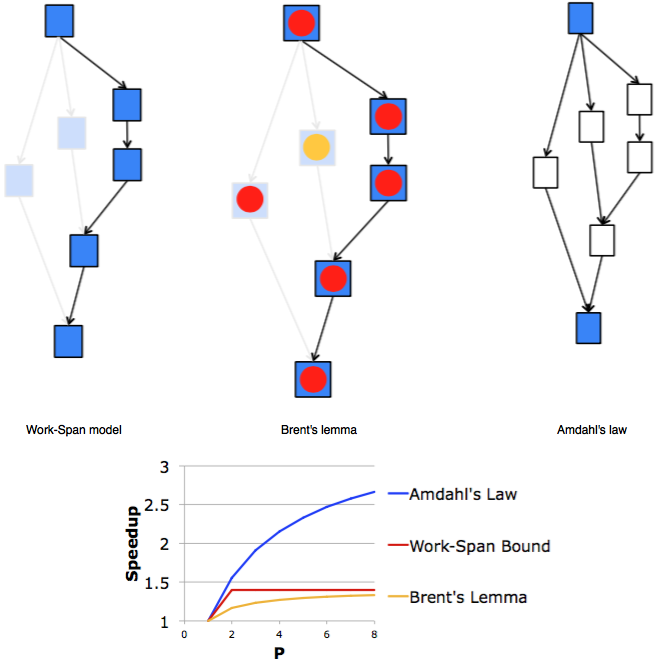

# Notes about General parallelism

## Execution time
Serial runtime (Ts) of a program is the time elapsed between the beginning and the end of its execution on a sequential computer.Parallel runtime (Tp) is the time that elapses from the moment the first processor starts to the moment the last processor finishes execution.

- Overhead function **To = pTp - Ts**
- Speedup **S = Ts / Tp**

## Adahl's law
**Adahl's law** gives the theoretical speedup in latency of the execution of a task at **fixed** workload that can be expected of a system whose resources are improved.

```
S_latency = 1 / ((1-p) + p/s)

S_latency: theoretical speedup in latency of the execution of the whole task;
s        : is the speedup in latency of the execution of the part of the task that benefits from the improvement of the resources of the system;
p        : percentage of the execution time of the whole task concerning the part that benefits from the improvement of the resources of the system before the improvement.
```
## Work - Span model
```
Tp = time to run with P workers
T1 = work
  - time for serial execution
  - sum of all work
  Too = span
    - time for critical path
```

Work-span limit: **Max(T1 / P, Too) <= Tp**

Brent's lemma: **Tp <= (T1 - Too)/P + Too**

Amdahl's law: **Tserial + Tparallel / P <= Tp**


